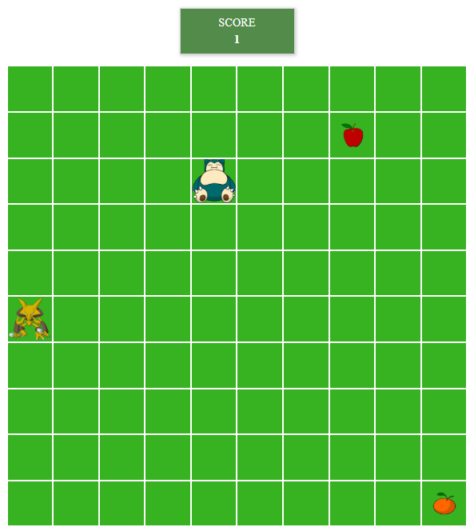

# Feed_Snorlax

> Improved version of my first simple JavaScript game (Furry_Game) 
(added random opponent, one fruit more to collect, speed of game increases and background changes after the score is getting higher)

## How to play?
* Use keyboard arrows to direct Snorlax.
* Collect as many apples and oranges as you can.
* Remember - don't bump into the wall!
* Beware the other Pokemon!

You can play here: https://michalpawelec.github.io/Feed_Snorlax/

## Used technologies and tools:
* CSS3
* HTML5
* JavaScript
* Webpack (to divide project into few JS files)
